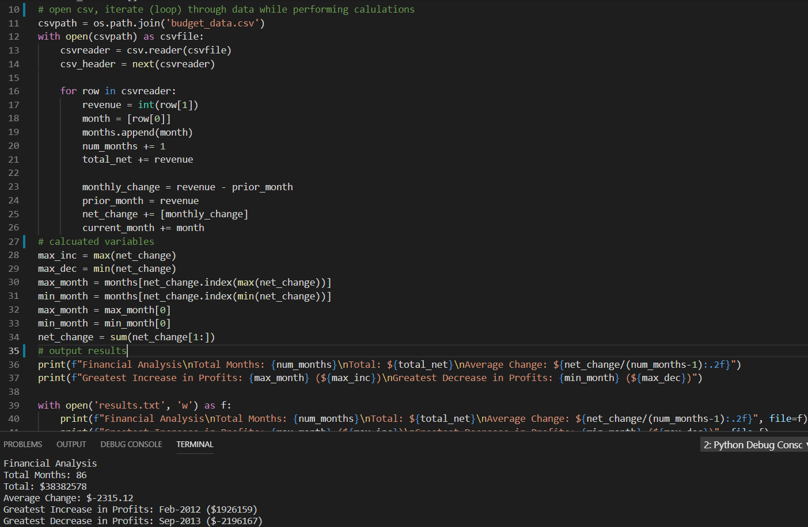

# Python Challenges

## Background

It's time to put away the Excel sheet and join the big leagues. Welcome to the world of programming.   Complete the **2** Python Challenges: PyBank and PyPoll.

Both of these challenges encompass a real-world situation where your Python scripting skills will come in handy. These challenges are far from easy so expect some hard work ahead!

### Summary (with links to my code)

* Use pythonic concepts in VSCode to solve the two challenges detailed below. Additionally, your [pybank script](pybank/pybank.py) and [pypoll script](pypoll/pypoll.py) should both print the results of analysis to the terminal and export a text file with the results.

## PyBank

* In this challenge, you are tasked with creating a Python script for analyzing the financial records of your company. You will give a set of financial data called [budget_data.csv](pybank/Resources/budget_data.csv). The dataset is composed of two columns: `Date` and `Profit/Losses`. (Thankfully, your company has rather lax standards for accounting so the records are simple.)

* The task is to create a Python script that analyzes the records to calculate each of the following:

  * The total number of months included in the dataset
  * The total net amount of "Profit/Losses" over the entire period
  * The average change in "Profit/Losses" between months over the entire period
  * The greatest increase in profits (date and amount) over the entire period
  * The greatest decrease in losses (date and amount) over the entire period

* As an example, your analysis should look similar to the image below:

## PyPoll

* In this challenge, you are tasked with helping a small, rural town modernize its vote-counting process. (Up until now, Uncle Cleetus had been trustfully tallying them one-by-one, but unfortunately, his concentration isn't what it used to be.)

* You will be give a set of poll data called [election_data.csv](pypoll/Resources/election_data.csv). The dataset is composed of three columns: `Voter ID`, `County`, and `Candidate`. Your task is to create a Python script that analyzes the votes and calculates each of the following:

  * The total number of votes cast
  * A complete list of candidates who received votes
  * The percentage of votes each candidate won
  * The total number of votes each candidate won
  * The winner of the election based on popular vote.

* As an example, your analysis should look similar to the one below:

## Hints and Considerations

* As you will discover, for some of these challenges, the datasets are quite large. This was done purposefully, as it showcases one of the limits of Excel-based analysis. While our first instinct, as data analysts, is often to head straight into Excel, creating scripts in Python can provide us with more robust options for handling "big data."